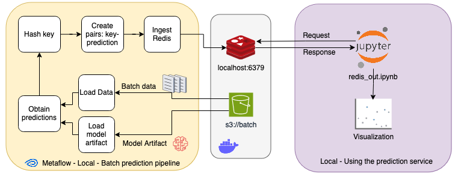

# Ejemplo de Batch Processing
### AMq2 - CEIA - FIUBA

##Integrantes
   - Gustavo Julian Rivas
   - Fabricio Lopretto
   - Myrna Lorena Degano
   - Santiago Jose Olaciregui



Este proyecto demuestra un ejemplo de procesamiento por lotes (Batch Processing) utilizando Metaflow, Redis, y modelos de aprendizaje automático. El proyecto utiliza el conjunto de datos de cáncer de mama de Scikit-learn para entrenar varios modelos y realizar predicciones en lote.

La implementación cuenta con una parte que funciona de forma local con Docker Compose:

## Docker Compose

Para este ejemplo se levantan dos servicios:

- [MinIO](https://min.io/): Con este servicio simulamos el uso de un Bucket S3 de Amazon. Para este ejemplo se crea un bucket llamado `batch` con los datos que se quieren predecir y el artefacto del modelo.
- [Redis](https://redis.io/): Redis es un motor de base de datos en memoria, basado en el almacenamiento en tablas de hashes. En este proyecto, se utiliza para almacenar las predicciones de baja latencia.
- [Metaflow](https://docs.metaflow.org/getting-started/overview): Metaflow es una biblioteca de Python para la ingeniería de datos y ciencia de datos. En este proyecto, se utiliza para gestionar los flujos de trabajo de entrenamiento de modelos y procesamiento por lotes.
- [PostgreSQL](https://postgres.com): Base de datos relacional para almacenar métricas de los modelos.

Para que levantar los servicios, desde la raíz de este repo hacer:
                                    

```bash
docker compose --profile metaflow up --build        
```                                                 


## Ejecución Local

Para la ejecución local se cuenta con dos DAGs de Metaflow:
- El DAG llamado `train_models.py` se encuentra en `metaflow`. Este DAG está diseñado para realizar el entrenamiento 
de los modelos del notebook original y almacenar los valores de las metricas en PostgreSQL.
- El DAG llamado `batch_processing.py` se encuentra en `metaflow`. Este DAG está diseñado para realizar predicciones 
en lotes utilizando un modelo previamente entrenado.
- Una notebook para testear a Redis. El notebook establece una conexión con el servidor Redis utilizando la biblioteca 
de Python para Redis. Luego, se recupera las predicciones almacenadas en Redis para los datos de entrada utilizando 
las claves generadas anteriormente.

Nota: Para que funcione tanto el DAG como la notebook, los servicios de Docker deben estar levantados.

## Flujos de Trabajo

### train_models.py

Este flujo realiza las siguientes tareas:

1. `start`:
   - Inicia el flujo de trabajo de entrenamiento de modelos.
   - Imprime un mensaje de inicio.

2. `load_and_prepare_data`:
   - Carga el conjunto de datos de cáncer de mama.
   - Prepara los datos, dividiéndolos en conjuntos de entrenamiento y prueba.
   - Escala los datos usando StandardScaler.
   - Guarda los datos de prueba y el scaler en S3 (MinIO) para su uso posterior.

3. `train_tree_model`, `train_svc_model`, `train_knn_model`, `train_reglog_model`:
   - Estas funciones se ejecutan en paralelo, cada una entrenando un modelo diferente:
     - Árbol de Decisión
     - SVC (Support Vector Classifier)
     - KNN (K-Nearest Neighbors)
     - Regresión Logística
   - Cada función realiza una búsqueda de hiperparámetros usando GridSearchCV.
   - Evalúa el mejor modelo usando métricas como precisión, recall y F1-score.
   - Guarda el mejor modelo entrenado en S3 (MinIO).

4. `join_models`:
   - Recopila los resultados de los modelos entrenados en paralelo.

5. `evaluate`:
   - Genera matrices de confusión y curvas ROC para cada modelo.
   - Calcula métricas adicionales como AUC.
   - Guarda las visualizaciones (matrices de confusión y curvas ROC) en S3 (MinIO).

6. `store_results`:
   - Almacena las métricas de rendimiento de cada modelo en PostgreSQL.

7. `end`:
   - Finaliza el flujo de trabajo.
   - Imprime un resumen de los resultados almacenados en la base de datos.


### batch_processing.py

Este flujo realiza las siguientes tareas:

1. `start`: 
   - Inicia el flujo e imprime un mensaje de inicio. 
   - Avanza para cargar los datos y el modelo.

2. `load_data`: 
   - Carga los datos de entrada desde un bucket S3 utilizando la biblioteca Metaflow.
   - Almacena los datos en un DataFrame de pandas.

3. `load_model`: 
   - Carga el modelo previamente entrenado desde un bucket S3 utilizando la biblioteca Metaflow.
   - Carga el modelo en un objeto XGBClassifier.

4. `batch_processing`: 
   - Utiliza el modelo cargado para realizar predicciones en lotes sobre los datos cargados.
   - Genera un hash para cada fila de datos.
   - Almacena las predicciones en un diccionario.

5. `ingest_redis`: 
   - Ingresa las predicciones en Redis utilizando la biblioteca de Python para Redis.
   - Establece una conexión con el servidor Redis.
   - Almacena las predicciones en Redis.

6. `end`: 
   - Imprime un mensaje de finalización del flujo.


Para ejecutar el flujo de trabajo de Metaflow hacer

```bash
python3 ./metaflow/train_models.py run
```

```bash
python3 ./metaflow/batch_processing.py run
```

Por ultimo, ingresar a la notebook y ejecutar las celdas correspondientes.


### Apagar los servicios

Estos servicios ocupan cierta cantidad de memoria RAM y procesamiento, por lo que cuando no se están utilizando, se 
recomienda detenerlos. Para hacerlo, ejecuta el siguiente comando:

```bash
docker compose down
```

Si deseas no solo detenerlos, sino también eliminar toda la infraestructura (liberando espacio en disco), 
utiliza el siguiente comando (usarlo con responsabilidad):

```bash
docker compose down --rmi all --volumes
```
